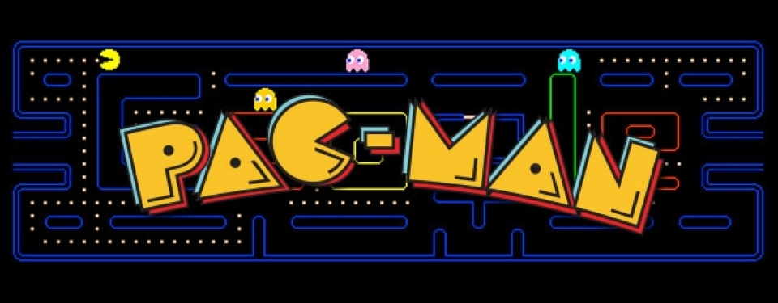

### Hi there 👋
<!-- https://devknowscode.com -->
I'm [@Phat](https://twitter.com/devknowscode), a full-stack developer committed to creating web and mobile applications. With expertise in front-end and back-end technologies, using React, Node.js and mobile framework like React Native, Flutter, I can build good user experiences across both web and mobile platforms. Let's collaborate on innovative projects that make a lasting impact! 🌐📱


Besides in my work, I'm also strong interested in AI. I love exploring the latest technologies in artificial intelligence and applying them to create innovative solutions. 🚀<br></br>

Check out my GitHub for exciting AI-related projects like:

- [Object Detection]() -  Develop a sentiment analysis model that can analyze the sentiment of social media posts or tweets.
- [Sentiment Analysis]() - Develop a sentiment analysis model that can analyze the sentiment of social media posts or tweets.
- [Chatbot with Natural Language Processing]() - Create a chatbot using natural language processing techniques.
- [Speech Recognition]() - Build a speech recognition system that can transcribe spoken words into text.

Working on AI projects brings me great joy in life, and I want to be able to do that as much and as long as I possible can. I hope you like what I work on and that some of it is useful to you. 

If you found anything that I built useful for you or your company, [consider sponsoring me](). ❤️

<!-- --- -->

<!-- #### Abilities -->
<!-- <p>


</p> -->


<!-- #### Skills & Tools
[](https://skillicons.dev) -->

<!-- --- -->

<!-- #### Coding Stats - Last 7 Days -->
<!--START_SECTION:waka-->

<!-- ```txt
Dart          8 hrs 7 mins    ⣿⣿⣿⣿⣿⣿⣿⣿⣿⣿⣿⣿⣿⣿⣿⣿⣷⣀⣀⣀⣀⣀⣀⣀⣀   67.05 %
YAML          1 hr 33 mins    ⣿⣿⣿⣄⣀⣀⣀⣀⣀⣀⣀⣀⣀⣀⣀⣀⣀⣀⣀⣀⣀⣀⣀⣀⣀   12.83 %
JavaScript    58 mins         ⣿⣿⣀⣀⣀⣀⣀⣀⣀⣀⣀⣀⣀⣀⣀⣀⣀⣀⣀⣀⣀⣀⣀⣀⣀   08.09 %
Bash          32 mins         ⣿⣄⣀⣀⣀⣀⣀⣀⣀⣀⣀⣀⣀⣀⣀⣀⣀⣀⣀⣀⣀⣀⣀⣀⣀   04.45 %
Markdown      27 mins         ⣿⣀⣀⣀⣀⣀⣀⣀⣀⣀⣀⣀⣀⣀⣀⣀⣀⣀⣀⣀⣀⣀⣀⣀⣀   03.77 %
``` -->

<!--END_SECTION:waka-->